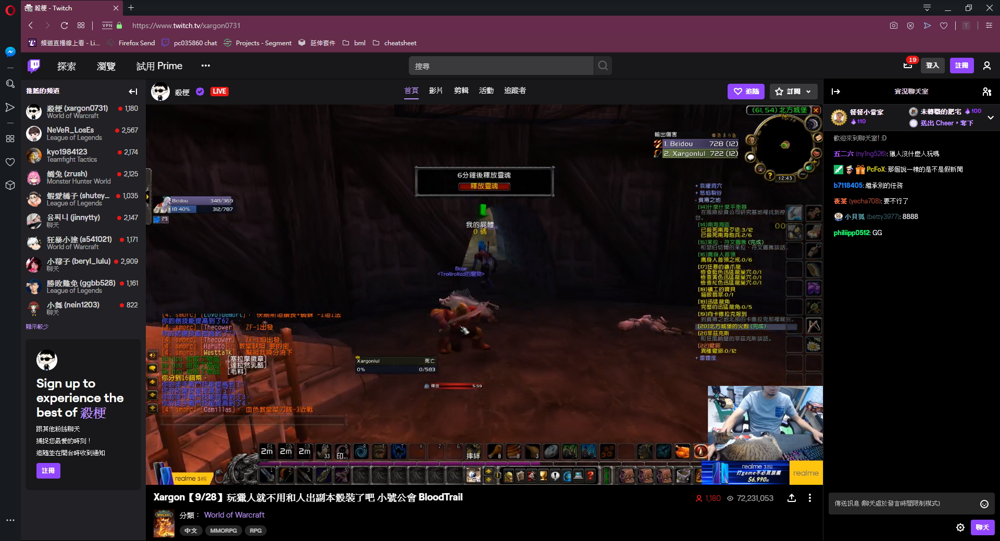

# Twitch REM fix

Twitch 自從去年改用 React 重寫之後，網站的主要排版單位都變成了 `rem`，然而他們的寫法會讓中文 Chrome 使用者碰到單位計算錯誤的問題，整個網站看起來會「大一號」。

原本應該長這樣



中文 Chrome 使用者看長這樣

![大一號]]]](./assets/borken.jpg "大一號")


安裝這個擴充功能可以簡單修正這個問題，還給你一個正常排版的 Twitch。


## 安裝

**Chrome Web Store**

待上傳


## 開發

```sh
# 這邊是用 yarn，npm 也適用

# install packages
yarn install

# build
yarn run build

# output: build/ folder
```
