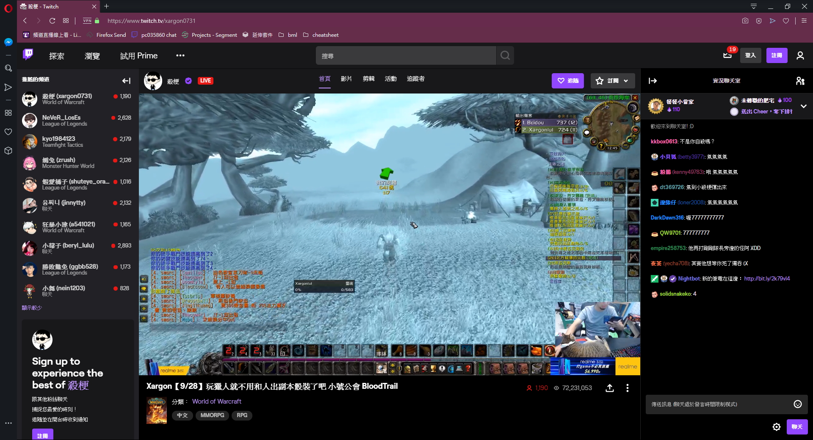
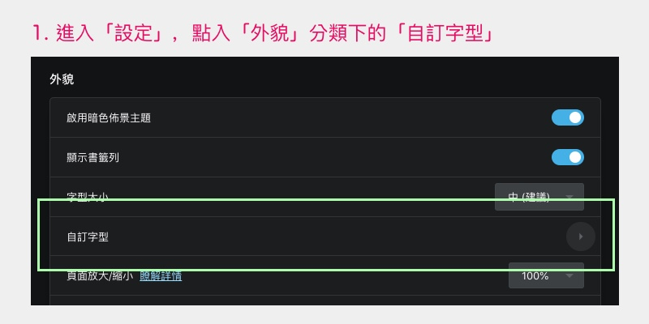
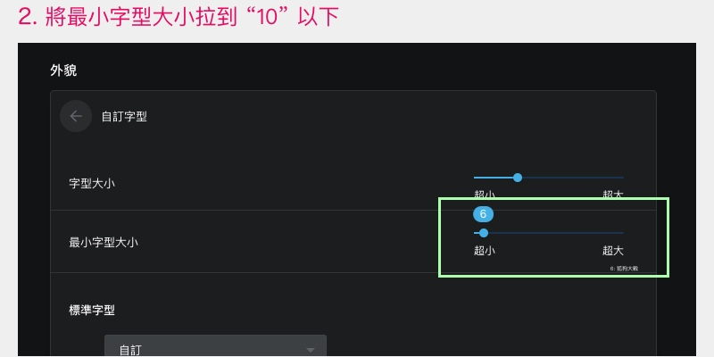

# Twitch REM fix

Twitch 自從去年改用 React 重寫之後，網站的主要排版單位都變成了 `rem`，然而他們的寫法會讓中文 Chrome 使用者碰到單位計算錯誤的問題，整個網站看起來會「大一號」。

原本應該長這樣


中文 Chrome 使用者看長這樣




安裝這個擴充功能可以簡單修正這個問題，還給你一個正常排版的 Twitch。


## 安裝

安裝完擴充功能之後，還要修改瀏覽器的字型設定才能夠讓它起作用。

**Chrome Web Store**

https://chrome.google.com/webstore/detail/twitch-rem-fix/nbgompppmhbnpkflbkapbeajmedpbgfm


### 更改瀏覽器設定

1. 進入「設定」，點入「外貌」分類下的「自訂字型」
2. 將最小字型大小拉到 “10” 以下






## 開發

```sh
# 這邊是用 yarn，npm 也適用

# install packages
yarn install

# build
yarn run build

# output: build/ folder
```
